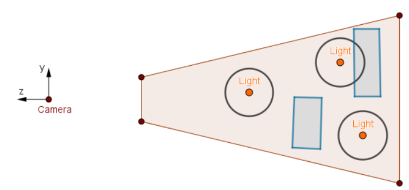
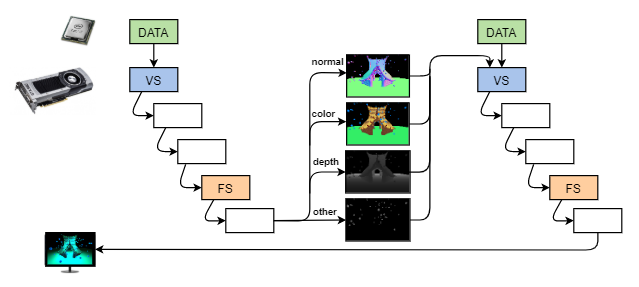
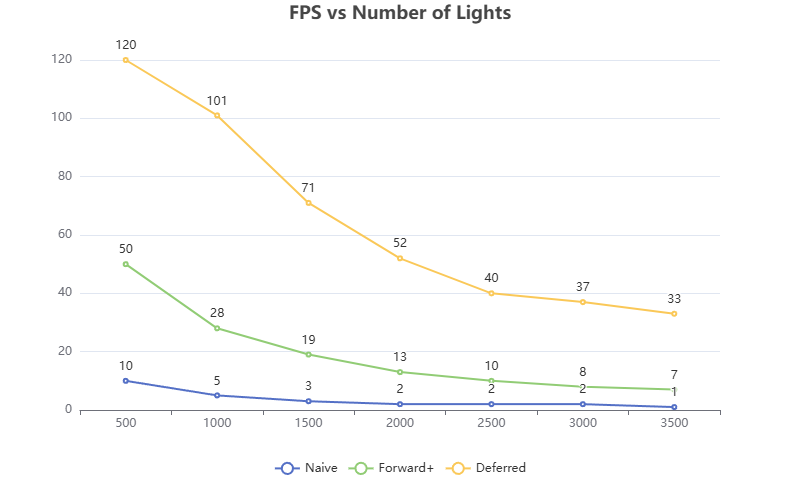
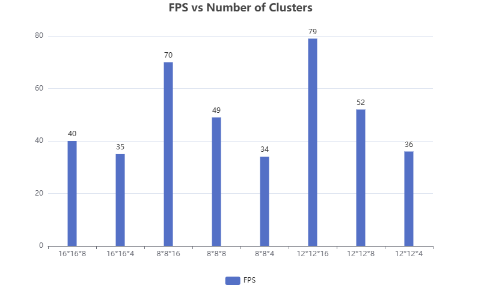

WebGL Forward+ and Clustered Deferred Shading
======================

**University of Pennsylvania, CIS 565: GPU Programming and Architecture, Project 4**

* Qirui (Chiray) Fu
  * [personal website](https://qiruifu.github.io/)
* Tested on my own laptop: Windows 11, i5-13500HX @ 2.5GHz 16GB, GTX 4060 8GB

### Demo GIF

https://github.com/user-attachments/assets/bf1abdaa-e290-4d2a-82c3-d5f609dbd047

https://github.com/user-attachments/assets/bb9e95bd-2bd0-429f-a4d4-77347e5d744d


### README
#### Features
In naive method, we have a loop like:

```
for all lightsource:
    for all objects:
        render this object using
        vertex & fragment shader
```

Of course this pipeline is really easy to implement. However, it's really slow, we need to render $N(objects) \times M(lights)$ times and a lot of computation is wasted. First, for each object, not all lights can affect on it, where we can reduce the computation of pairs. Additionally, a lot of objects are hiddent by others, lots of output of shaders are not shown on the final figure. From these two aspects, we could introduce two faster rendering methods.

##### Forward+
For the first problem, we can divide view space into different regions and record which lights are located in each region. In the rendering stage, we only need to consider the lights that are in the same region as object. Actually, this idea is really similar with BOF - the difference here, we are dividing the view space instead of whole domain.



#### Deferred
For the second problem, our solution is storing the albedo, normal and depth of objects that will finally be rendered for each pixel. This needs more memory since we have buffers to save them. During rendering, we don't need to consider geometry anymore, we can just use the information stored in the buffer to compute final colors.



#### Performance Analyse
In this test scene, the FPS mainly depends on the number of lights. For three methods(including naive implementation), we have a chart:



From the chart we can tell that combination of Forward+ and Deferred could improve the performance a lot. It's expected since we have less computation to do and less memory visiting. Furthermore, we can also explore the influnce of the number of clusters. Currenlty, the view space is divided into $16\times16\times8$ . We can try more configurations (3000 lights scene) :



From the chart we can find that the number of clusters on Z axis dominates the performance. The more clusters we have on this direction, the higher FPS we could achieve. However, we are not able to contain too many clusters. During my test, if we have $16\times16\times16$ clusers, the rendering result is completely black.(I am still trying to figure out what's happening here)


### Credits

- [Vite](https://vitejs.dev/)
- [loaders.gl](https://loaders.gl/)
- [dat.GUI](https://github.com/dataarts/dat.gui)
- [stats.js](https://github.com/mrdoob/stats.js)
- [wgpu-matrix](https://github.com/greggman/wgpu-matrix)
